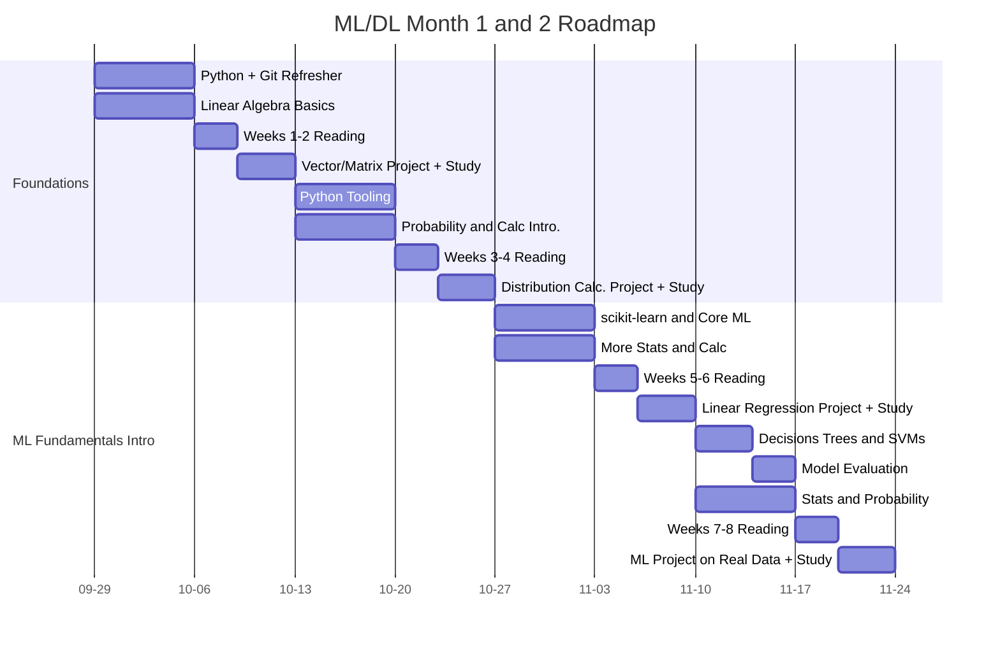

## Reading List

| Weeks   | Textbook or Paper | Section |
| :---: | :---: | :---: |
| 1 and 2  | [Mathematics for Machine Learning](https://github.com/Dueling-W/ml-dl-skills/blob/main/Textbooks/mml-book.pdf)  | Chapters 2 and 3  |
| 1 and 2  | [The Elements of Statistical Learning](https://github.com/Dueling-W/ml-dl-skills/blob/main/Textbooks/ESLII_print12_toc.pdf)  | Intro and Chapter 1  |
| 3 and 4  | [Mathematics for Machine Learning](https://github.com/Dueling-W/ml-dl-skills/blob/main/Textbooks/mml-book.pdf)  | Chapters 5 and 6  |
| 3 and 4  | [Convext Optimization](https://stanford.edu/~boyd/cvxbook/bv_cvxbook.pdf)  | Sections 1.1-1.3  |
| 5 and 6  | [Pattern Recognition and Machine Learning](https://github.com/Dueling-W/ml-dl-skills/blob/main/Textbooks/Bishop-Pattern-Recognition-and-Machine-Learning-2006.pdf)  | Chapters 1-3  |
| 5 and 6  | [A Few Useful Things to Know About Machine Learning (2012)](https://github.com/Dueling-W/ml-dl-skills/blob/main/Academic%20Papers/useful_things_about_ml.pdf)  | All  |
| 7 and 8  | [Pattern Recognition and Machine Learning](https://github.com/Dueling-W/ml-dl-skills/blob/main/Textbooks/Bishop-Pattern-Recognition-and-Machine-Learning-2006.pdf)  | Chapter 4 |
| 7 and 8  | [PCA original paper (Hotelling, 1933)](https://github.com/Dueling-W/ml-dl-skills/blob/main/Academic%20Papers/pca_hotelling.pdf)  | Skim Notation  |

## Quick Links and Resources

### Weeks 1 and 2 All Resources
- **Python Videos**:
    - [Python Refresher](https://www.youtube.com/watch?v=VchuKL44s6E&t=94s)
    - [Python Concepts](https://www.youtube.com/watch?v=Gx5qb1uHss4)
    - [Python OOP Full Course](https://www.youtube.com/watch?v=Ej_02ICOIgs)
    - [Python Iterators](https://www.youtube.com/watch?v=jTYiNjvnHZY)
    - [Python Generators](https://www.youtube.com/watch?v=bD05uGo_sVI)
    - [Python Exceptions Intro](https://www.youtube.com/watch?v=6SPDvPK38tw)
- **GitHub Intro Videos**:
    - [GitHub Crash Course](https://www.youtube.com/watch?v=RGOj5yH7evk&t=425s)
- **Math Links**
    - [Vectors and Spaces](https://www.khanacademy.org/math/linear-algebra/vectors-and-spaces)
    - [Matrix Transformations](https://www.khanacademy.org/math/linear-algebra/matrix-transformations)

---

### Weeks 3 and 4 All Resources
- **Python Videos**
    - [PyTest Course](https://www.youtube.com/watch?v=cHYq1MRoyI0)
- **Math Links**
    - [Random Variables](https://www.khanacademy.org/math/statistics-probability/random-variables-stats-library)
    - [Probability Distributions](https://www.khanacademy.org/math/statistics-probability/modeling-distributions-of-data)

---

### Week 5 and 6 All Resources
- **Python and Theory Videos**
    - [scikit-learn Course - Up to Preprocessing](https://www.youtube.com/watch?v=0B5eIE_1vpU)
    - [Linear and Logistic Regression](https://www.youtube.com/watch?v=0B5eIE_1vpU)
    - [kNN](https://www.youtube.com/watch?v=CQveSaMyEwM)
    - [Gradient Descent](https://www.youtube.com/watch?v=IHZwWFHWa-w)
- **Math Links**
    - [Correlation and Regression](https://www.khanacademy.org/math/statistics-probability/describing-relationships-quantitative-data)
    - [Calculus Refresher](https://www.youtube.com/watch?v=WsQQvHm4lSw)
    - [Gradients and Directional Derivatives](https://www.khanacademy.org/math/multivariable-calculus/multivariable-derivatives/gradient-and-directional-derivatives)

---

### Week 7 and 8 All Resources
- **Python and Theory Videos**
    - [scikit-learn Course - Rest of Video](https://www.youtube.com/watch?v=0B5eIE_1vpU)
- **Math Links**
    - [Hypothesis Testing](https://www.khanacademy.org/math/statistics-probability/significance-tests-one-sample)
    - [Law of Large Numbers](https://www.khanacademy.org/math/statistics-probability/random-variables-stats-library/expected-value-lib/v/law-of-large-numbers)
    - [Sampling Distributions and Central Limit Theorem)[https://www.khanacademy.org/math/statistics-probability/sampling-distributions-library/sample-means]

